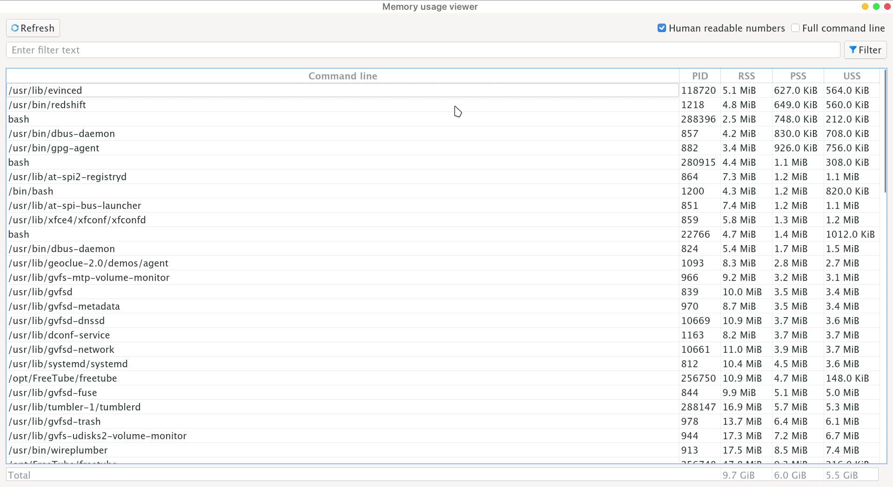

# Introduction

This application is a simple graphical interface atop of great [smem](https://github.com/kwkroeger/smem) tool by Kurt Kroeger. It does not aim to provide all the features of smem command.
I made this tool to easily visualize the "real memory" consumption of processes. For each process, PID, RSS, PSS and USS are displayed. The more realistic process memory consumption is given by PSS field which counts the process private memory plus the proportion of shared memory accountable to this process.
You're allowed to filter processes by name and visualize the total memory occupied by filtered processes.

# Screenshots

# Requirements

This tool is made for Linux operating system.

This project depends on:
- python >= 3   (tested with version 3.10.5)
- PyQt5
- [smem](https://github.com/kwkroeger/smem)

# Usage
The 'genDesktopEntry.sh' script can be used to generate a .desktop entry copied into ~/.local/share/applications directory.

Run './run.sh' to launch the application.

# License
Code is under MIT license.

Icons contained in icons/ directory are made by **Freepik** on [flaticon](https://www.flaticon.com/).
They are under flaticon license.
Credits for icons to [link](https://www.flaticon.com/authors/freepik).

